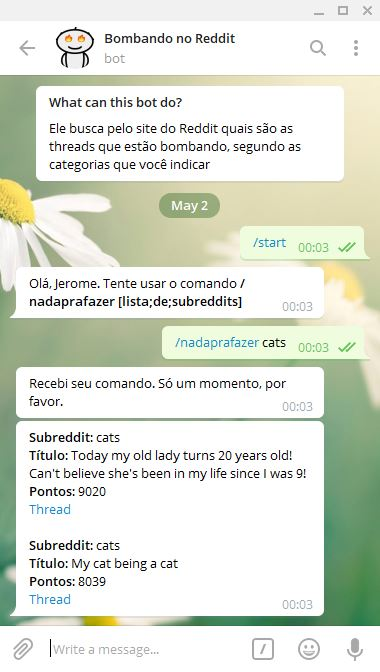

# Reddit Telegram Bot

Developed in **Python**, version 3.6.4.

Dependencies:

- requests
- lxml
- python-telegram-bot

File [reddit_telegram_bot.py](https://github.com/jeromevonk/desafio_idwall/blob/master/crawlers/reddit_telegram_bot.py) implements a **Telegram** bot , taking advantage of the **python-telegram-bot** library .

It is a simple bot that answers to the command */nothingtodo [lista;de;subreddits]*.

It can be found on **Telegram** as [@RedditBombando_bot](https://telegram.me/RedditBombando_bot). It is hosted on Heroku.

Take this screenshot for example (in Portuguese):

